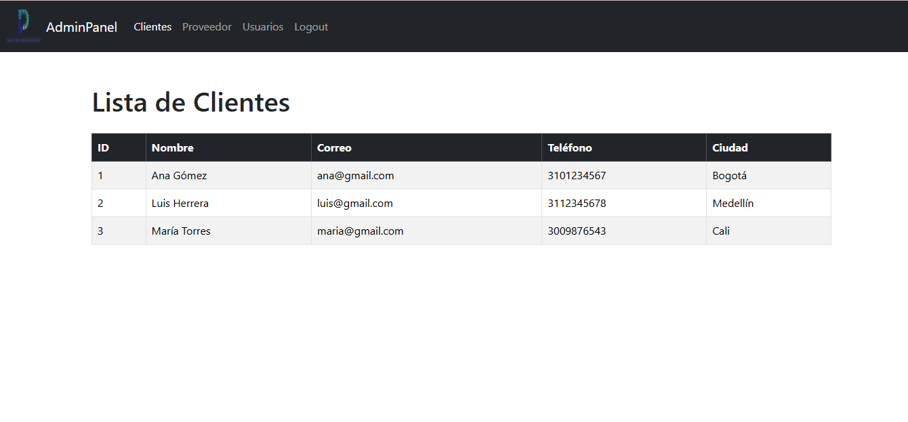

# 🛠️ Panel Administrativo Web con React JS

**Proyecto del Taller de Panel Administrativo**  
Escuela de Ingeniería de Sistemas e Informática  
📅 I Semestre 2025  
👨‍🏫 Profesor: Carlos Adolfo Beltrán Castro  
👨‍💻 Estudiantes: Marcos José Orjuela Murillo - 2225506 Y Emersson Elian López Pita - 2225507

## 🚀 Descripción del Proyecto

Este sitio web simula un panel administrativo desarrollado con **React** y **Vite**. Incluye navegación moderna entre diferentes secciones y el uso de **Bootstrap 5** como framework de diseño.

## 📂 Estructura del Proyecto

- **Navbar** con logo e ítems de navegación:
  - Clientes
  - Proveedor
  - Usuarios
  - Logout
- **Rutas** creadas con `react-router-dom`.
- **Vistas** con tablas de ejemplo en Clientes, Proveedor y Usuarios.
- **Logout** con mensaje informativo de cierre de sesión.

## 🧰 Tecnologías Usadas

- React
- Vite
- React Router DOM
- Bootstrap 5

## 🔧 Instalación y ejecución


```bash
# Clona este repositorio
git clone https://github.com/tuusuario/panel-admin-react.git

# Entra al proyecto
cd panel-admin-react

# Instala dependencias
npm install

# Ejecuta el servidor en desarrollo
npm run dev

